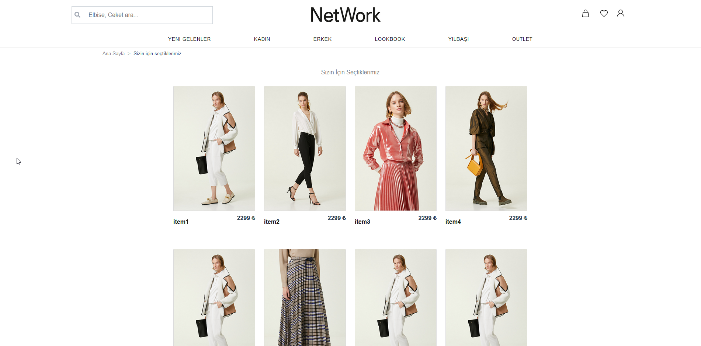
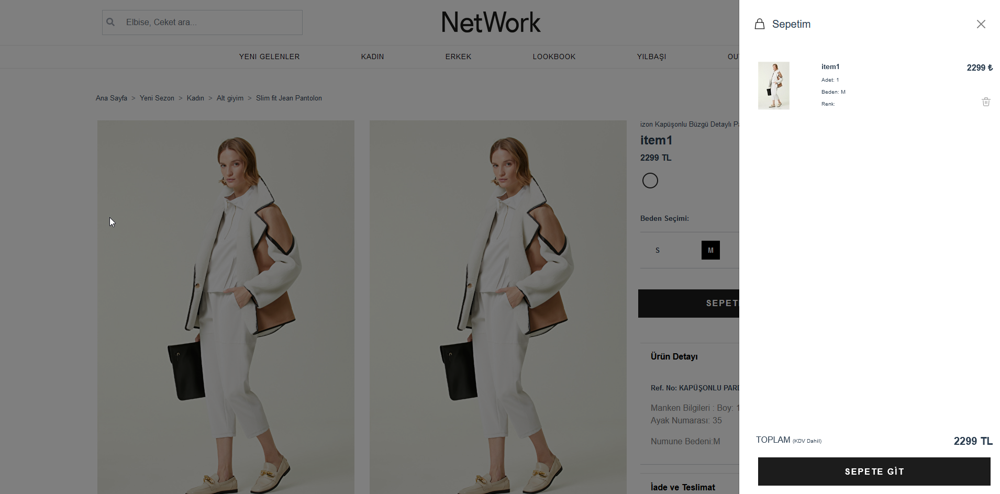

# Network.com.tr Clone
#### This project is built for educational purpose.It's a partial copy of ```Network.com.tr``` by using VueJs and simple expressJs and firebase.

## Tech Stack

**Client:** VueJs,Vuex,Bootstrap,Css,Html

**Server:** Node, Express,Firebase NoSql Database,Firebase Functions,Apollo Graphql

  
## Screenshots

- [Click here to see rest of the screenshots](./screenshots/Readme.md)


  
## What I learned from this project

- How to use VueJs and Vuex
- Designing a website with Bootstrap, Css and Html
- Using basic features of Firebase Functions
- Using Apollo Graphql
- Fundementals of ExpressJs

  
## Run Locally

- Clone the project

```bash
  git clone https://github.com/ourcelik/NetworkClone.git
```

- Go to the project directory

```bash
  cd NetworkClone
```

- firebase Database is not active in this project. You can use your own firebase database.If you don't want to use firebase database you can use the mock data in the project by changing the the HEAD Pointer to the following commit.

```bash
  git checkout 0770dbb1fd50082bede536f49e9cf29f4206dc39
```

- Install dependencies

```bash
  npm install
```

- Start the server

```bash
  cd client
```
  
```bash
  npm run serve
```

```bash
  cd server
```

```bash
  npm start
```

## Contributors

- [@ourcelik]([https://](https://github.com/ourcelik))
- [@SefaZorr](https://github.com/sefazorr)
